# Graphical User Interface Prototype  

Authors: Riccardo Tornesello, Francesco Grande, Muhammad Sarib Khan, Silvio Tanzarella

Date: 12/04/2022

Version: 1.0

## Wireframes

### Log in

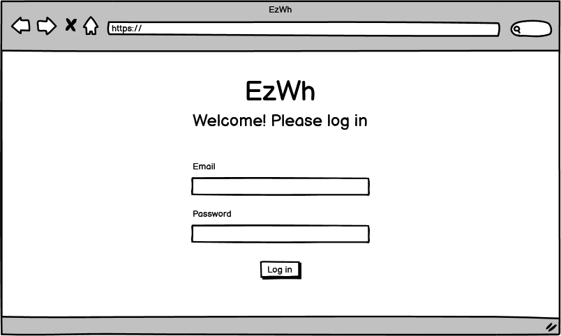

### Add employee

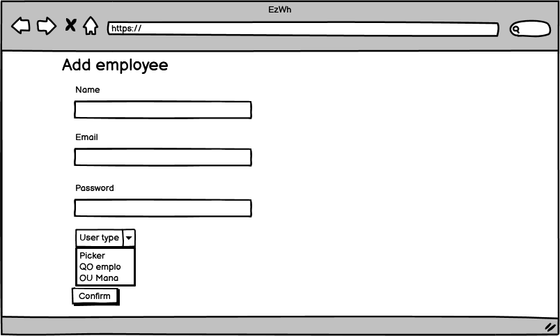

### Items

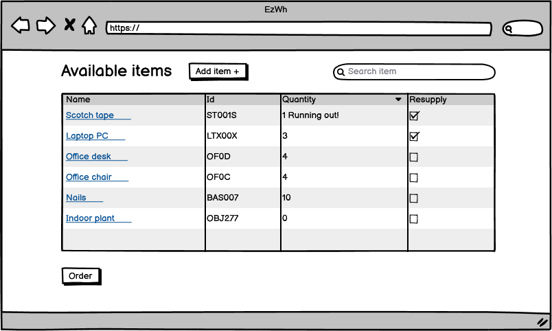

### Item details

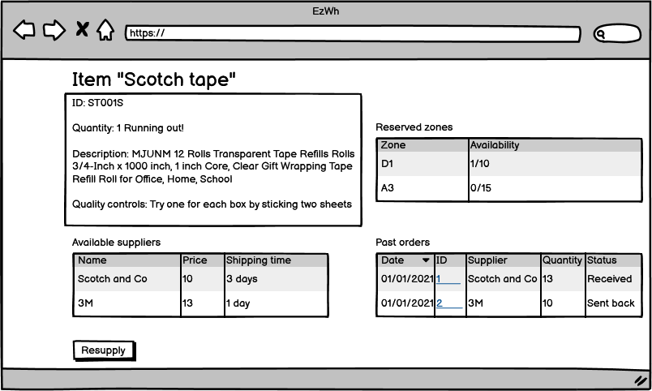

### Add item

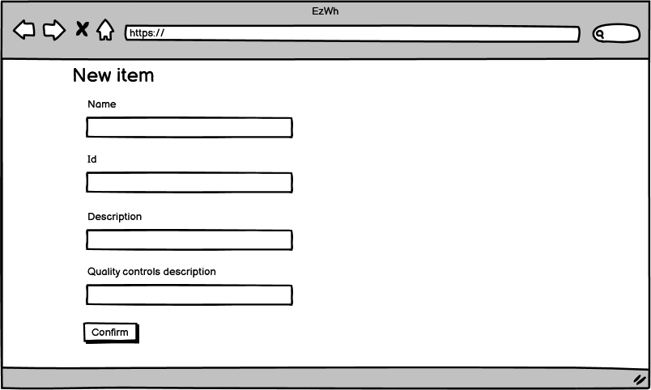

### Supplier details

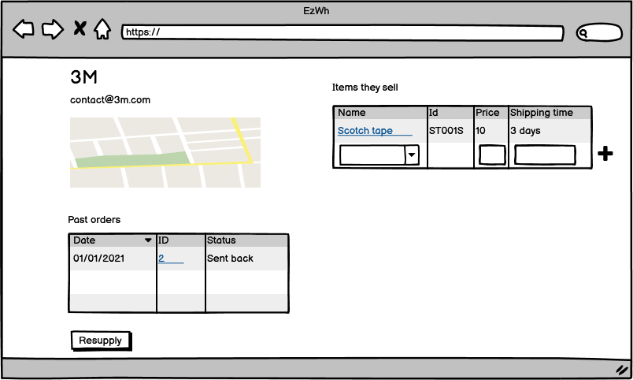

### Add supplier

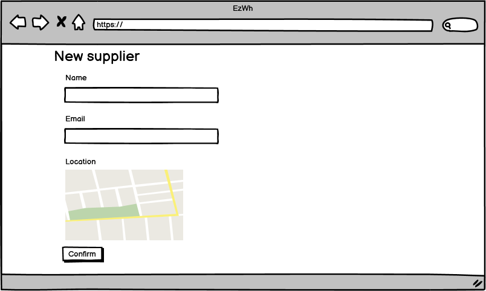

### Internal order creation

### Orders list

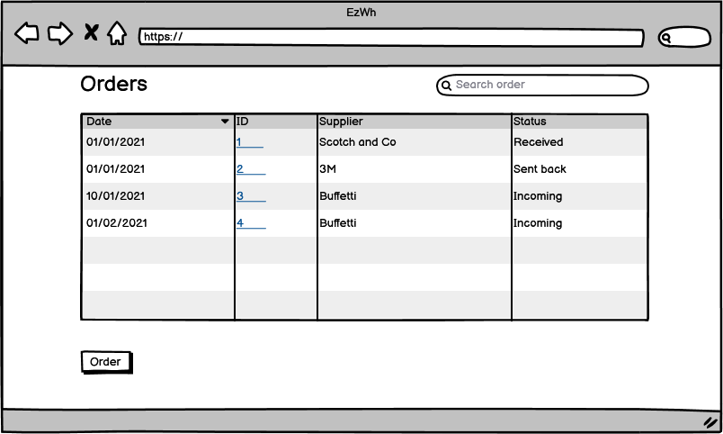

### Order details

### Internal order details

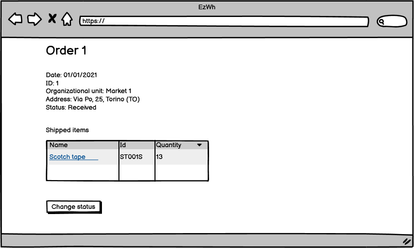

### Interface for quality office employee

### Warehouse setup

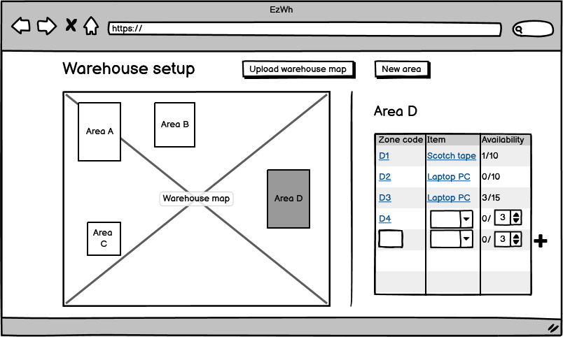

### Interface for picker

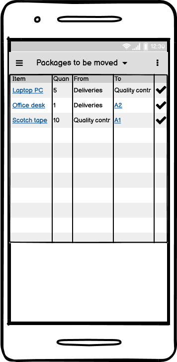

### Expense report

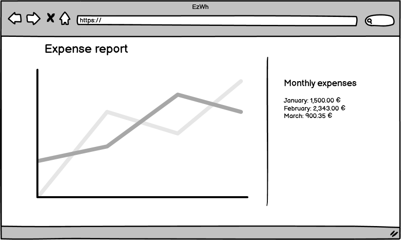
