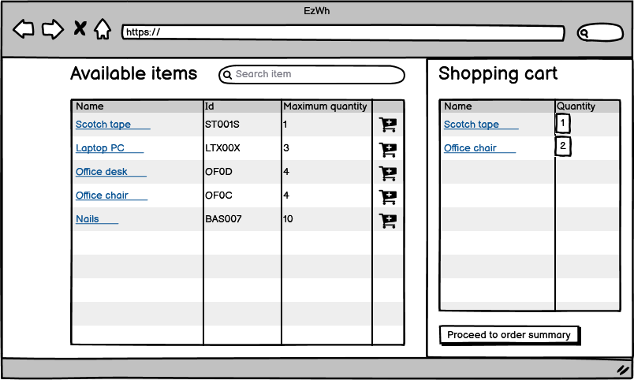
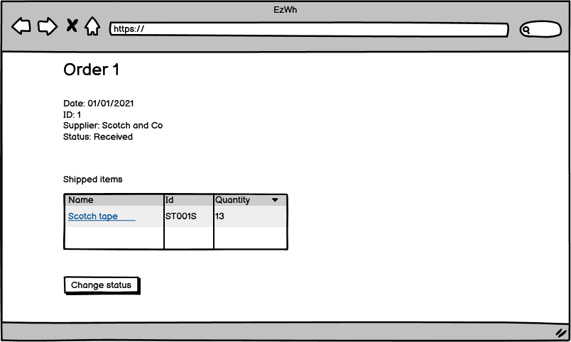
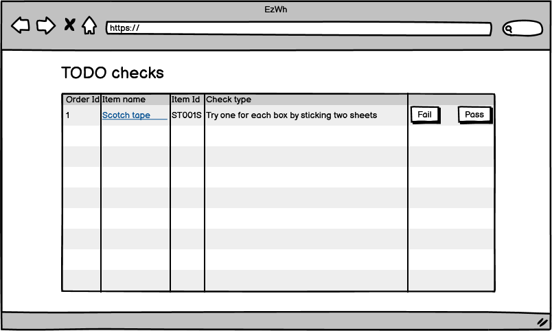

# Graphical User Interface Prototype  

Authors: Riccardo Tornesello, Francesco Grande, Muhammad Sarib Khan, Silvio Tanzarella

Date: 12/04/2022

Version: 1.0

## Wireframes

### Log in

### Add employee

### Items

### Item details

### Add item

### Supplier details

### Add supplier

### Internal order creation

### Orders list

### Order details

### Internal order details

### Interface for quality office employee

### Warehouse setup

### Interface for picker

### Expense report

