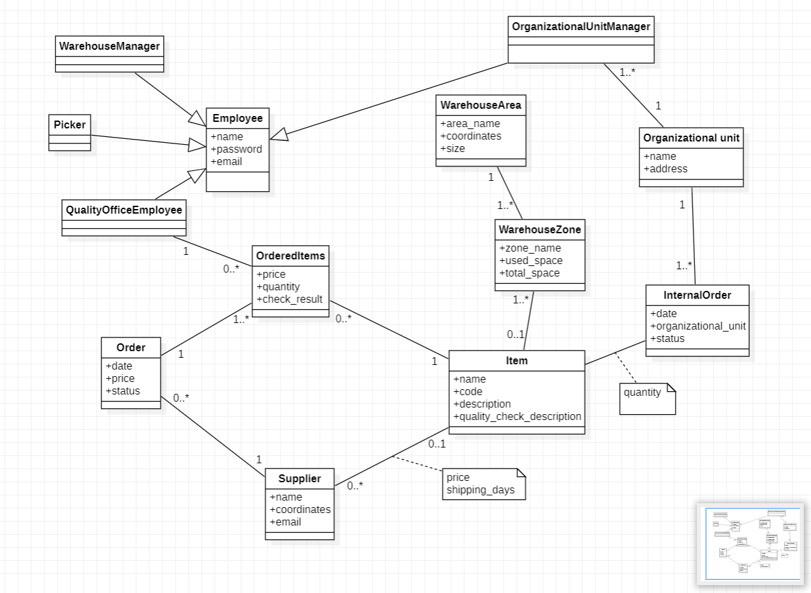
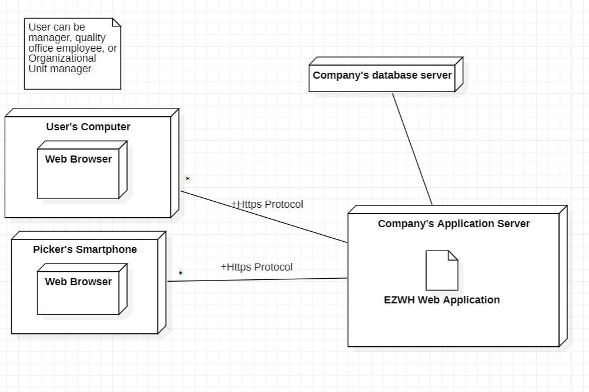

# Requirements Document 

Date: 13 april 2022

Version: 1.0

 
| Version number | Change |
| ----------------- |:-----------|
| | | 

# Contents

- [Informal description](#informal-description)
- [Stakeholders](#stakeholders)
- [Context Diagram and interfaces](#context-diagram-and-interfaces)
	+ [Context Diagram](#context-diagram)
	+ [Interfaces](#interfaces) 
	
- [Stories and personas](#stories-and-personas)
- [Functional and non functional requirements](#functional-and-non-functional-requirements)
	+ [Functional Requirements](#functional-requirements)
	+ [Non functional requirements](#non-functional-requirements)
- [Use case diagram and use cases](#use-case-diagram-and-use-cases)
	+ [Use case diagram](#use-case-diagram)
	+ [Use cases](#use-cases)
    	+ [Relevant scenarios](#relevant-scenarios)
- [Glossary](#glossary)
- [System design](#system-design)
- [Deployment diagram](#deployment-diagram)

# Informal description
Medium companies and retailers need a simple application to manage the relationship with suppliers and the inventory of physical items stocked in a physical warehouse. 
The warehouse is supervised by a manager, who supervises the availability of items. When a certain item is in short supply, the manager issues an order to a supplier. In general the same item can be purchased by many suppliers. The warehouse keeps a list of possible suppliers per item. 

After some time the items ordered to a supplier are received. The items must be quality checked and stored in specific positions in the warehouse. The quality check is performed by specific roles (quality office), who apply specific tests for item (different items are tested differently). Possibly the tests are not made at all, or made randomly on some of the items received. If an item does not pass a quality test it may be rejected and sent back to the supplier. 

Storage of items in the warehouse must take into account the availability of physical space in the warehouse. Further the position of items must be traced to guide later recollection of them.

The warehouse is part of a company. Other organizational units (OU) of the company may ask for items in the warehouse. This is implemented via internal orders, received by the warehouse. Upon reception of an internal order the warehouse must collect the requested item(s), prepare them and deliver them to a pick up area. When the item is collected by the other OU the internal order is completed. 

EZWH (EaSy WareHouse) is a software application to support the management of a warehouse.

# Stakeholders

| Stakeholder name  | Description | 
| ----------------- |:-----------:|
| Companies / Retailers | It needs to store items in a warehouse | 
| Suppliers | They receive orders from the companies / retailers and supply them with requested items|
| Manager | He supervises the availability of items, of physical space in the warehouse and he issues the orders |
| Quality office employee | It performs quality check|
| Organizational unit manager | Asks for items in the warehouse  |
| Start up partner | Who advertises the application |
| Start up financer | A bank, investors, etc. |
| Competitors | Other applications with similar purpose |
| Transporters | Who transports items to and from the warehouse |
| Pickers | Who transports the items in the warehouse |

# Context Diagram and interfaces

## Context Diagram

Actors:
- Manager
- Quality office employee
- Organizational unit manager
- Pickers

## Interfaces

| Actor | Physical Interface | Logical Interface  |
| ------------- |:-------------:| -----:|
|Manager| PC | Web GUI |
|Quality office employee| PC | Web GUI |
|Organizational unit manager| PC | Web GUI |
|Picker| Smartphone | Web GUI |

# Stories and personas

**Persona 1**: Manager, medium retail company with sufficient revenue, Torino, values time and prefers restocking as soon as possible

**Story**: Checks the available stock of items using the application; finds an item low on stock; assesses possible suppliers of that item using the application; time is valued; the supplier with the quickest delivery time/geographically nearest supplier of the item is chosen, no matter the price; details of order are inserted in the application.

**Persona 2**: Manager, medium retail company with constraints on revenue, Torino 

**Story**: Similar series of steps as story of persona 1 until supplier selection, since low revenue, cheapest supplier is chosen, regardless of other 
attributes of the supplier. details of the order are inserted in the application.

**Persona 3**: Picker, medium company

**Story 1**: Transporter delivers the order from supplier to warehouse, picker double checks the order details from application, after successful check, receives it, changes the state of ordered item to “received” in application, no quality test required as per the application, puts the item in the location suggested by application.

**Story 2**: similar series of steps as story 1 of persona 4, now quality test is required, picker transport the item to quality office.

**Persona 4**: Quality office, medium company

**Story 1**: Quality office employee receives item, performs quality test, test is passed, result is saved in application, picker takes the item from quality office, puts in the suggested location by application. 

**Story 2**: test is failed, result is saved in the application, item is rejected. 

**Persona 5**: Manager, medium company

**Story**: Item fails quality test, manager sees test results on application, contacts suppliers, transporter takes the item back to supplier. 

**Persona 6**: Manager, medium company 

**Story**: Organizational Unit manager places internal order (outside application), order details are inserted into the application, a picker gets the items (Notified through application), prepares and delivers them to pickup area, Organization unit receives items, internal order complete. 

**Persona 7**: Manager 

**Story**: new stock is incoming; manager configures the warehouse to optimally use the capacity. 

**Persona 8**: Manager

**Story**: Company hires a new picker; Picker needs login credentials for the application; Manager creates an account for the picker on the application;  

# Functional and non functional requirements

## Functional Requirements

| ID        | Description  |
| ------------- |:-------------:| 
| FR1 | Manage warehouse |
| FR1.2 | Assign the available physical space |
| FR1.3 | Change the number of available items |
| FR1.4 | Generate expense report |
| FR2 | Authorize and authenticate |
| FR2.2 | Log in |
| FR2.3 | Log out |
| FR2.4 | Create account for employees |
| FR3 | Configure items |
| FR3.2 | Add or update item |
| FR3.3 | Add supplier |
| FR3.4 | Update item price from supplier |
| FR3.5 | Update quality check details |
| FR4 | Restock the warehouse |
| FR4.2 | Check item availability |
| FR4.3 | Create order |
| FR4.4 | List orders and get details |
| FR4.5 | Add quality check results |
| FR4.6 | Send back broken item |
| FR5 | Send item to organizational unit |
| FR6 | Track item position in the warehouse |

## Non Functional Requirements

| ID        | Type        | Description  | Refers to |
| ------------- |:-------------:| :-----| -----:|
| NFR1 | Usability | Application should be used by professional users which can receive a short training. However, it cannot be too difficult to not give advantage to competitors | All FR |
| NFR2 | Security | The informations of the company should be secret can be accessed only by the Manager. The other employees should be able to access only the required informations about the specific items. | All FR |
| NFR3 | Performance | All functions should complete in < 0.5 sec  | All FR |
| NFR4 | Portability | The application should be accessed by old browsers in desktop or mobile devices. Chrome > v0.75, Firefox > v88, Safari > v14.1.2, Opera > 70 | All FR |
| NFR5 | Localisation | Use dot as decimal separator in decimal numbers and comma as separator for thousands | All FR |
| NFR6 | Localisation | Use euro as currency symbol | All FR |
| NFR7 | Efficiency | The user devices are slow and the heavy work should be concentrated on the server. Optimize the operations so the application is compatible with cheaper hardware. | All FR |
| NFR8 | Correctness | This application will be sold on the shelf, so it's impossible to be 100% correct for every company. Should be able to do what most of the warehouses require. |

# Use case diagram and use cases

## Use case diagram

### Use case 1, Manage Warehouse
| Actors Involved        |	Manager	|
| :------------- |:-------------| 
|  Precondition | Manager is authenticated and authorized |
|  Post condition | Warehouse information are updated |
|  Nominal Scenario | Order gets received |
|  Variants | Items arrive at the warehouse but without being part of an order |
|  Exceptions | Manager inserts wrong information into the application exceding parameters |

##### Scenario 1.1 

| Scenario 1.1 | Nominal |
| :-------------: |:-------------| 
|  Precondition     | Manager is authenticated and authorized, an order was created for the items |
|  Post condition     | Warehouse information are updated correctly |
| Step#        | Description  |
|  1  | New items arrive at the warehouse|  
|  2  | Manager add the items location in the warehouse |
|  3  | Manager confirms the order reception |
|  4  | Application checks if there is enough space in the warehouse and if that location is available |
|  5  | Application updates the avaiable physical space and the avaiable items number |

##### Scenario 1.2

| Scenario 1.2 | Items arrive at the warehouse but without being part of an order |
| :-------------: |:-------------| 
|  Precondition     | Manager is authenticated and authorized, there is no order for the items |
|  Post condition     | Warehouse information are updated correctly |
| Step#        | Description  |
|  1  | New items arrive at the warehouse|
|  2  | Manager updates manually the available physical space in the warehouse |
|  3  | Manager updates manually the items number available in the warehouse |
|  4  | Manager add the items location in the warehouse |
|  5  | Manager confirms the order reception |
|  6  | Application checks if there is enough space in the warehouse and if that location is available |
|  7  | Application updates the avaiable physical space and the avaiable items number |

##### Scenario 1.3

| Scenario 1.3 | Manager inserts wrong information into the application exceding parameters |
| :-------------: |:-------------| 
|  Precondition     | Manager is authenticated and authorized, there is no order for the items |
|  Post condition     | Warehouse information are not updated |
| Step#        | Description  |
|  1  | New items arrive at the warehouse|  
|  2  | Manager updates manually the available physical space in the warehouse, but he inserts the wrong value and he exceeds the parameters |
|  3  | Manager updates manually the items number available in the warehouse |
|  4  | Manager add the items location in the warehouse |
|  5  | Manager confirms the order reception |
|  6  | Application checks if there is enough space in the warehouse and if that location is available |
|  7  | Application doesn't update information |

### Use case 2, Authorize and Authenticate: Log In

| Actors Involved        |	Manager, Quality Office Employee, Organizational Unit Manager, Picker	|
| :------------- |:-------------| 
|  Precondition | User account exists |
|  Post condition | User logged in the application |
|  Nominal Scenario | User inserts proper credentials in the application |
|  Variants | Password is expired |
|  Exceptions | User inserts wrong credentials |

##### Scenario 2.1 

| Scenario 2.1 | Nominal |
| :-------------: |:-------------| 
|  Precondition     | User account exists |
|  Post condition     | User logged in the application |
| Step#        | Description  |
|  1  | User asks to log in |  
|  2  | Application asks for email and password |
|  3  | User inserts email and password |
|  4  | Application checks if email and password are correct |
|  5  | Application log in the user |

##### Scenario 2.2 

| Scenario 2.2 | Password is expired |
| :-------------: |:-------------| 
|  Precondition     | User account exists |
|  Post condition     | User logged in the application |
| Step#        | Description  |
|  1  | User asks to log in |  
|  2  | Application asks for email and password |
|  3  | User inserts email and password |
|  4  | Application checks if email and password are correct |
|  5  | Password is expired, application asks to the user to insert a new password |
|  6  | Password is changed, now user can do again log in with the new password, repeating from step 1 to 4 |
|  7  | Application log in the user |

##### Scenario 2.3 

| Scenario 2.3 | User inserts wrong credentials |
| :-------------: |:-------------| 
|  Precondition     | User inserts wrong credentials |
|  Post condition     | Application prints an error |
| Step#        | Description  |
|  1  | User asks to log in |  
|  2  | Application asks for email and password |
|  3  | User inserts email and password |
|  4  | Application checks if email and password are correct |
|  5  | Email and password are incorrect, application prints an error |

### Use case 2, Authorize and Authenticate: Log Out

| Actors Involved        |	Manager, Quality Office Employee, Organizational Unit Manager, Picker	|
| :------------- |:-------------| 
|  Precondition | User logged in the application |
|  Post condition | User logged out the application |
|  Nominal Scenario | User clicks on log out button |
|  Variants | User was updating information in the application while clicking on log out button |
|  Exceptions | |

##### Scenario 2.4 

| Scenario 2.4 | Nominal |
| :-------------: |:-------------| 
|  Precondition     | User logged in the application |
|  Post condition     | User logged out the application |
| Step#        | Description  |
|  1  | User clicks on log out button |  
|  2  | The application log out the user and redirect him to the homepage |

##### Scenario 2.5 

| Scenario 2.5 | User was updating information in the application while clicking on log out button |
| :-------------: |:-------------| 
|  Precondition     | User logged in the application and updating something |
|  Post condition     | User logged out the application |
| Step#        | Description  |
|  1  | User clicks on log out button | 
|  2  | User was updating some information but he didn't confirm changes, he lost all updates | 
|  3  | The application log out the user and redirect him to the homepage |

### Use case 2, Authorize and Authenticate: Create Account

| Actors Involved        | Manager	|
| :------------- |:-------------| 
|  Precondition | User doesn't exist |
|  Post condition | User exists in the application |
|  Nominal Scenario | User creates an account |
|  Variants | |
|  Exceptions | User already exists |

##### Scenario 2.6

| Scenario 2.6 | Nominal |
| :-------------: |:-------------| 
|  Precondition     | User doesn't exist |
|  Post condition     |  User exists in the application |
| Step#        | Description  |
|  1  | User asks to create an account |  
|  2  | Application asks for user information |
|  3  | User enters requested information |
|  4  | Application checks if account already exists |
|  5  | Application creates an account for the user |

##### Scenario 2.7

| Scenario 2.7 | User already exists |
| :-------------: |:-------------| 
|  Precondition     | User already exists |
|  Post condition     |  Nothing change |
| Step#        | Description  |
|  1  | User asks to create an account |  
|  2  | Application asks for user information |
|  3  | User enters requested information |
|  4  | Application checks if account already exists |
|  5  | Account already exists, application prints an error message and nothing else changes |

### Use case 3, Manage Inventory

| Actors Involved        | Manager	|
| :------------- |:-------------| 
|  Precondition | Manager is authenticated and authorized  |
|  Post condition | Inventory updated |
|  Nominal Scenario | Manager manages correctly the inventory |
|  Variants | Item information are wrong, supplier for that item is wrong |
|  Exceptions | Price is negative, item already exists |

##### Scenario 3.1

| Scenario 3.1 | Nominal |
| :-------------: |:-------------| 
|  Precondition     | Manager is authenticated and authorized, he inserts proper information |
|  Post condition     |  Item added to inventory |
| Step#        | Description  |
|  1  | Manager ask the application to insert a new item in the inventory |  
|  2  | Application asks for item information |
|  3  | Manager enters requested information |
|  4  | Application checks if item already exists |
|  5  | Item is added correctly to the inventory |

##### Scenario 3.2

| Scenario 3.2 | Item information are wrong |
| :-------------: |:-------------| 
|  Precondition     | Manager is authenticated and authorized, he inserts wrong item information |
|  Post condition     |  Item added to inventory with wrong information, then fixed |
| Step#        | Description  |
|  1  | Manager asks to the application to insert a new item in the inventory |  
|  2  | Application asks for item information |
|  3  | Manager enters requested information, but he does some mistake and inserts wrong information |
|  4  | Application checks if item already exists |
|  5  | Item is added to the inventory |
|  6  | Manager notices the mistake and asks to the application to update the item |
|  7  | Application asks for new item information |
|  8  | Manager enters correct information |
|  9  | Item is now added to the inventory with proper information |

##### Scenario 3.3

| Scenario 3.3 | Supplier for that item is wrong |
| :-------------: |:-------------| 
|  Precondition     | Manager is authenticated and authorized, supplier doesn't sell that item |
|  Post condition     |  Item added to inventory with wrong supplier, then fixed |
| Step#        | Description  |
|  1  | Manager asks to the application to insert a new item in the inventory |  
|  2  | Application asks for item information |
|  3  | Manager enters requested information, but he does some mistake and inserts wrong supplier for the item |
|  4  | Application checks if item already exists |
|  5  | Item is added to the inventory |
|  6  | Manager notices the mistake and asks to the application to update the item |
|  7  | Application asks for new item information |
|  8  | Manager enters correct supplier |
|  9  | Item is now added to the inventory with proper information |

##### Scenario 3.4

| Scenario 3.4 | Price is negative |
| :-------------: |:-------------| 
|  Precondition     | Manager is authenticated and authorized, price inserted is negative |
|  Post condition     |  Nothing change |
| Step#        | Description  |
|  1  | Manager asks to the application to insert a new item in the inventory |  
|  2  | Application asks for item information |
|  3  | Manager enters requested information, but he does some mistake and inserts negative price |
|  4  | Application doesn't add item to the inventory |

##### Scenario 3.5

| Scenario 3.5 | Item already exists |
| :-------------: |:-------------| 
|  Precondition     | Manager is authenticated and authorized, item already exists |
|  Post condition     |  Nothing change |
| Step#        | Description  |
|  1  | Manager asks to the application to insert a new item in the inventory |  
|  2  | Application asks for item information |
|  3  | Manager enters requested information, but he inserts an item that already is in the inventory |
|  4  | Application doesn't add again item to the inventory |

### Use case 4, Restock the Warehouse

| Actors Involved        | Manager	|
| :------------- |:-------------| 
|  Precondition | Manager is authenticated and authorized  |
|  Post condition | New order to restocking the warehouse is created, order list details is showed |
|  Nominal Scenario | Manager creates a new order, manager checks order list details  |
|  Variants | Item is not available from a given supplier, there are no orders to show |
|  Exceptions | Item is not available, requested quantity is not available |

##### Scenario 4.1

| Scenario 4.1 | Nominal: manager creates a new order |
| :-------------: |:-------------| 
|  Precondition     | Manager is authenticated and authorized, item quantity and supplier are available |
|  Post condition     | New order is created |
| Step#        | Description  |
|  1  | Manager asks to the application to create a new order |  
|  2  | Application asks for order details (items, quantity, supplier) |
|  3  | Manager enters requested details |
|  4  | Application checks details and creates a new order |

##### Scenario 4.2

| Scenario 4.2 | Item is not available from a given supplier |
| :-------------: |:-------------| 
|  Precondition     | Manager is authenticated and authorized, item is not available from a given supplier |
|  Post condition     | New order is created |
| Step#        | Description  |
|  1  | Manager asks to the application to create a new order |  
|  2  | Application asks for order details (items, quantity, supplier) |
|  3  | Manager enters requested details |
|  4  | Application checks details, supplier is not available for that item |
|  5  | Application asks to choose another supplier |
|  6  | Manager chooses another supplier and enters again order details |
|  7  | Application checks details and creates a new order |

##### Scenario 4.3

| Scenario 4.3 | Item is not available |
| :-------------: |:-------------| 
|  Precondition     | Manager is authenticated and authorized, item is not available |
|  Post condition     | Nothing changes |
| Step#        | Description  |
|  1  | Manager asks to the application to create a new order |  
|  2  | Application asks for order details (items, quantity, supplier) |
|  3  | Manager enters requested details |
|  4  | Application checks details, item is not available |
|  5  | Application doesn't create order |

##### Scenario 4.4

| Scenario 4.4 | Requested quantity is not available |
| :-------------: |:-------------| 
|  Precondition     | Manager is authenticated and authorized, requested quantity is not available |
|  Post condition     | Nothing changes |
| Step#        | Description  |
|  1  | Manager asks to the application to create a new order |  
|  2  | Application asks for order details (items, quantity, supplier) |
|  3  | Manager enters requested details |
|  4  | Application checks details, item quantity is not available |
|  5  | Application doesn't create order |

##### Scenario 4.5

| Scenario 4.5 | Nominal: manager checks order list details |
| :-------------: |:-------------| 
|  Precondition     | Manager is authenticated and authorized, there are orders stored in the database |
|  Post condition     | Order list details is showed |
| Step#        | Description  |
|  1  | Manager asks to the application to show the order list details |  
|  2  | Application checks the database and shows the list |

##### Scenario 4.6

| Scenario 4.6 | There are no orders to show |
| :-------------: |:-------------| 
|  Precondition     | Manager is authenticated and authorized, there are no orders stored in the database |
|  Post condition     | Nothing is showed |
| Step#        | Description  |
|  1  | Manager asks to the application to show the order list details |  
|  2  | Application checks the database, there is no order inside |
|  3  | Application doesn't show anything |

### Use case 5, Check Item Quality

| Actors Involved        | Quality Office Employee |
| :------------- |:-------------| 
|  Precondition | Quality office employee is authenticated and authorized  |
|  Post condition | Quality is checked |
|  Nominal Scenario | Quality office employee checks quality and items are stored |
|  Variants | Need more items to test |
|  Exceptions | Quality check not passed: resend back items |

##### Scenario 5.1

| Scenario 5.1 | Nominal |
| :-------------: |:-------------| 
|  Precondition     | Quality office employee is authenticated and authorized, items quality is good |
|  Post condition     | Items are stored |
| Step#        | Description  |
|  1  | Quality office employee checks item quality, it's good |
|  2  | Employee asks to the application to create a new test |  
|  3  | Application asks to the employee to choose the test type and if passed or not |
|  4  | Items are stored inside the warehouse |

##### Scenario 5.2

| Scenario 5.2 | Need more items to test |
| :-------------: |:-------------| 
|  Precondition     | Quality office employee is authenticated and authorized, items quality is good except for few ones |
|  Post condition     | Items are stored |
| Step#        | Description  |
|  1  | Quality office employee checks item quality, it's not so good |
|  2  | Employee asks to the application to create a new test |  
|  3  | Application asks to the employee to choose the test type and if passed or not |
|  4  | Employee checks other pieces of that item, the quality is good |
|  5  | Employee redo 2 and 3 |
|  6  | Items are stored inside the warehouse |

##### Scenario 5.3

| Scenario 5.3 | Quality check not passed: resend back items |
| :-------------: |:-------------| 
|  Precondition     | Quality office employee is authenticated and authorized, items quality is not good except for few ones |
|  Post condition     | Items are stored |
| Step#        | Description  |
|  1  | Quality office employee checks item quality, it's not so good |
|  2  | Employee asks to the application to create a new test |  
|  3  | Application asks to the employee to choose the test type and if passed or not |
|  4  | Employee checks other pieces of that item, the quality is still not good |
|  5  | Employee redo 2 and 3 |
|  6  | Items are resent back |

### Use case 6, Request Items to Organizational Units

| Actors Involved        | Organizational Unit Manager |
| :------------- |:-------------| 
|  Precondition | Organizational Unit Manager is authenticated and authorized  |
|  Post condition | Request is elaborated |
|  Nominal Scenario | Request is legit and items are moved to another organizational unit |
|  Variants | Items quantity requested is not available |
|  Exceptions | Items requested are not available |

##### Scenario 6.1

| Scenario 6.1 | Nominal |
| :-------------: |:-------------| 
|  Precondition     | Organizational Unit Manager is authenticated and authorized, request is legit |
|  Post condition     | Items are moved to another organizational unit |
| Step#        | Description  |
|  1  | Organizational Unit Manager asks to the application to create a new items request | 
|  2  | Application asks to the manager to insert which items and in which quantity |
|  3  | Application checks if the requested items are available |
|  4  | A picker take the items and moves them to the OU who requested it |
|  5  | OU confirms items reception on the application |

##### Scenario 6.2

| Scenario 6.2 | Items quantity requested is not available |
| :-------------: |:-------------| 
|  Precondition     | Organizational Unit Manager is authenticated and authorized, items quantity requested is not available |
|  Post condition     | Less items than needed are moved to another organizational unit |
| Step#        | Description  |
|  1  | Organizational Unit Manager asks to the application to create a new items request | 
|  2  | Application asks to the manager to insert which items and in which quantity |
|  3  | Application checks if the requested items are available |
|  4  | The requested quantity is not available, application modify the request with the available items number |
|  5  | A picker take the items and moves them to the OU who requested it |
|  6  | OU confirms items reception on the application |

##### Scenario 6.3

| Scenario 6.3 | Items requested are not available |
| :-------------: |:-------------| 
|  Precondition     | Organizational Unit Manager is authenticated and authorized, items requested are not available |
|  Post condition     | Nothing happens |
| Step#        | Description  |
|  1  | Organizational Unit Manager asks to the application to create a new items request | 
|  2  | Application asks to the manager to insert which items and in which quantity |
|  3  | Application checks if the requested items are available |
|  4  | The requested items are not available, application reject items request |

### Use case 7, Move Items

| Actors Involved        | Picker |
| :------------- |:-------------| 
|  Precondition | Picker is authenticated and authorized  |
|  Post condition | Move request is completed |
|  Nominal Scenario | Picker gets a request and he moves items to the correct pick-up area |
|  Variants | Picker is busy with another request |
|  Exceptions | Picker hasn't enough space to transport items |

##### Scenario 7.1

| Scenario 7.1 | Items are moved to the correct pick-up area |
| :-------------: |:-------------| 
|  Precondition     | Picker is authenticated and authorized, he has enough space to transport items |
|  Post condition     | Nothing happens |
| Step#        | Description  |
|  1  | Picker gets a new move request from the application | 
|  2  | Picker retrieves the items location and he takes them  |
|  3  | Picker moves items to the designed pick-up area |
|  4  | Picker updates the new item location and he confirms the delivery on the application |

##### Scenario 7.2

| Scenario 7.2 | Picker is busy with another request |
| :-------------: |:-------------| 
|  Precondition     | Picker is authenticated and authorized, he has enough space to transport items but right now is resolving another request |
|  Post condition     | Items are delivered a bit later |
| Step#        | Description  |
|  1  | Picker gets a new move request from the application | 
|  2  | Picker is already busy with another requests, he completes first that |
|  3  | Picker retrieves the items location and he takes them  |
|  4  | Picker moves items to the designed pick-up area |
|  5  | Picker updates the new item location and he confirms the delivery |

##### Scenario 7.3

| Scenario 7.3 | Picker hasn't enough space to transport items |
| :-------------: |:-------------| 
|  Precondition     | Picker is authenticated and authorized, he hasn't enough space to transport items |
|  Post condition     | Items aren't delivered, wait for another picker|
| Step#        | Description  |
|  1  | Picker gets a new move request from the application | 
|  2  | Picker retrieves the items location and he goes to the pick-up area |
|  3  | Picker notices that he hasn't enough space on his warehouse cart, he rejects the request |
|  4  | Application looks for another picker |

# Glossary

# System Design

# Deployment Diagram 

